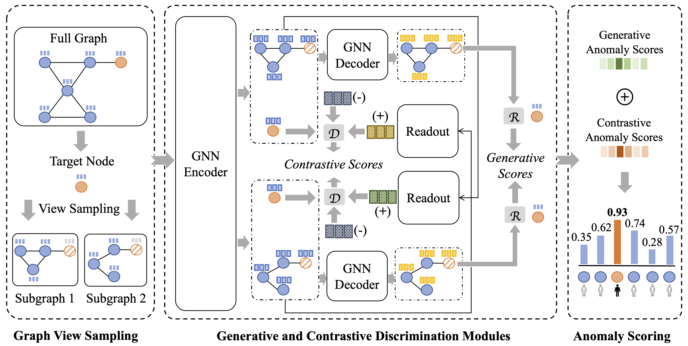

# SL-GAD

A PyTorch implementation of "[Generative and Contrastive Self-Supervised Learning for Graph Anomaly Detection](https://arxiv.org/pdf/2108.09896.pdf)", <em>IEEE Transactions on Knowledge and Data Engineering (TKDE)</em>.

<p align="center">

</p>

## Dependencies
+ python==3.6.1
+ dgl==0.4.1
+ matplotlib==3.3.4
+ networkx==2.5
+ numpy==1.19.2
+ pyparsing==2.4.7
+ scikit-learn==0.24.1
+ scipy==1.5.2
+ sklearn==0.24.1
+ torch==1.8.1
+ tqdm==4.59.0

To install all dependencies:
```
pip install -r requirements.txt
```

## Usage
To train and evaluate on BlogCatalog:
```
python run.py --device cuda:0 --expid 1 --dataset BlogCatalog --runs 5 --auc_test_rounds 256 --alpha 1.0 --beta 0.6
```
To train and evaluate on Flickr:
```
python run.py --device cuda:0 --expid 2 --dataset Flickr --runs 5 --auc_test_rounds 256 --alpha 1.0 --beta 0.6
```
To train and evaluate on Cora:
```
python run.py --device cuda:0 --expid 3 --dataset cora --runs 5 --auc_test_rounds 256 --alpha 1.0 --beta 0.6
```
To train and evaluate on CiteSeer:
```
python run.py --device cuda:0 --expid 4 --dataset citeseer --runs 5 --auc_test_rounds 256 --alpha 1.0 --beta 0.4
```
To train and evaluate on PubMed:
```
python run.py --device cuda:0 --expid 5 --dataset pubmed --runs 5 --auc_test_rounds 256 --alpha 1.0 --beta 0.4
```
To train and evaluate on ACM:
```
python run.py --device cuda:0 --expid 6 --dataset ACM --runs 5 --auc_test_rounds 256 --alpha 1.0 --beta 0.2
```

## Citation
If you use our code in your research, please cite the following article:
```
@article{zheng2021generative,
  title={Generative and Contrastive Self-Supervised Learning for Graph Anomaly Detection},
  author={Zheng, Yu and Jin, Ming and Liu, Yixin and Chi, Lianhua and Phan, Khoa T and Chen, Yi-Ping Phoebe},
  journal={IEEE Transactions on Knowledge and Data Engineering (TKDE)},
  year={2021}
}
```
